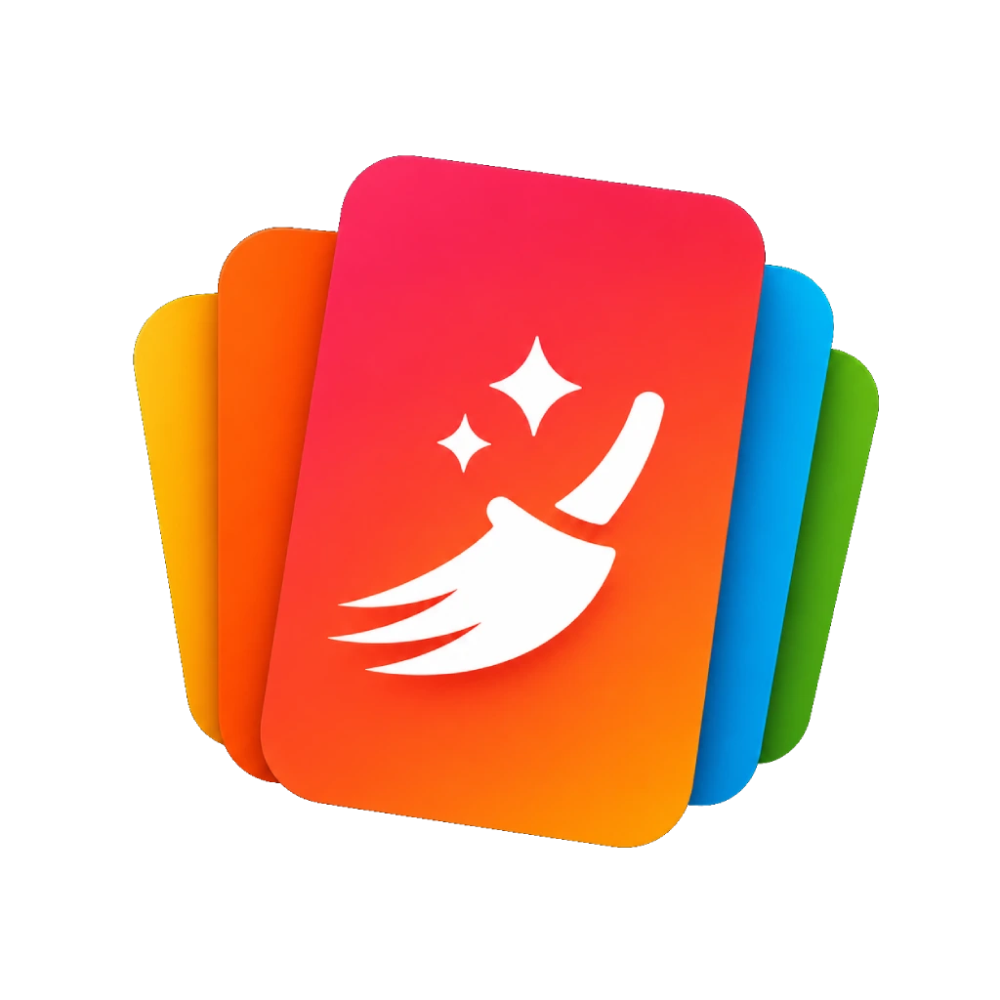

<p align="center">
  
</p>

<h1 align="center">Cleanify</h1>

<p align="center">
  <strong>Swipe. Sort. Reclaim your space. 100% offline.</strong>
</p>

<p align="center">
  <a href="LICENSE"></a>
  <a href="https://github.com/mini-page/Cleanify/releases"></a>
  <a href="https://github.com/mini-page/Cleanify/issues"></a>
  
  
</p>

---

Cleanify is a powerful, privacy-first Android app for managing your photos, videos, and files. Sort through thousands of files with a fun Tinder-style swipe interface, find and eliminate duplicate or similar media, and clean up junk — all without ever touching the internet.

**Your files never leave your device.**

---

## Table of Contents

- [Screenshots](#screenshots)
- [Features](#features)
  - [Swipe Sorter](#-swipe-sorter)
  - [Duplicate Finder](#-duplicate-finder)
  - [Empty Cleaner](#-empty-cleaner--junk-remover)
  - [Recycle Bin](#-recycle-bin)
  - [Storage Analysis](#-storage-analysis)
  - [Session Setup](#-session-setup)
  - [Appearance & Theming](#-appearance--theming)
  - [Customization & Settings](#-customization--settings)
  - [Accessibility](#-accessibility)
  - [App Shortcuts & Widgets](#-app-shortcuts--widgets)
- [Supported File Types](#supported-file-types)
- [Privacy](#privacy-first)
- [Getting Started](#getting-started)
- [Permissions Explained](#permissions-explained)
- [For Developers](#for-developers)
- [Contributing](#contributing)
- [Donating](#donating)
- [License](#license)

---

## Screenshots

<p align="center">
  
  &nbsp;
  
  &nbsp;
  
  &nbsp;
  
</p>

<p align="center"><em>Note: The AMOLED theme has a true-black background by design.</em></p>

---

## Features

### 🃏 Swipe Sorter

The core of Cleanify — a card-based sorting experience that makes managing thousands of files effortless.

#### Gestures
| Gesture | Default Action |
|---------|---------------|
| **Swipe Right** | ✅ Keep file |
| **Swipe Left** | 🗑️ Delete file |
| **Swipe Down** | Configurable (see settings) |
| **Tap** | Open media context menu |

#### Actions Per File
- **Keep** — mark the file to stay untouched
- **Delete** — queue the file for deletion
- **Move** — send the file to any target folder
- **Skip** — defer the decision and come back later
- **Undo** — instantly reverse the last action at any time
- **Screenshot Frame** — extract a still image (JPEG) from any video moment
- **Screenshot + Delete** — extract the frame *and* queue the original video for deletion
- **Share** — send to another app directly from the review queue
- **Open With** — launch in any compatible app
- **Rename** — rename the file inline
- **Open Full Screen** — view the media at full resolution
- **Media Preview** — tap any card to open an immersive full-screen viewer with pinch-to-zoom and double-tap reset; close and delete button overlays only

#### Target Folder Bar
- Add, remove, and reorder quick-move target folders per session
- Horizontal or vertical layout (configurable)
- Expand / collapse the bar
- Favorite folders persist across sessions
- Export and import your favorite target folder lists (JSON)

#### Summary Sheet (Pending Changes Review)
Before anything is applied, review every queued action:
- **To Delete**, **To Keep**, **To Move** (grouped by destination), **To Convert to Image**
- Switch between List, Grid, and Compact view modes
- **Apply Changes** — execute all file operations at once (with confirmation dialog)
- **Cancel All** — discard all pending decisions, start fresh

#### End-of-Session
- Review items you skipped
- Go back to select different folders
- Reset sorted history for a single folder
- Reset all sorted media history

#### Video Playback
- Inline video player with play/pause and mute/unmute
- Configurable default playback speed (e.g. 0.5x, 1x, 2x)
- Continuous loop while reviewing

#### Performance
- Coil-powered image preloading with a dedicated GIF-optimized loader
- JIT MediaStore indexing for unindexed `file://` URIs
- Pending swipe decisions survive process death via `SavedStateHandle`

---

### 🔍 Duplicate Finder

Free up gigabytes by eliminating exact copies and visually similar media.

#### Two Scan Modes

**Exact Duplicates**
Uses a multi-phase hybrid hashing strategy:
1. Group files by size (instant pre-filter)
2. For images: pixel hash at 256px thumbnail size
3. For videos: SHA-256 of first 256 KB
4. For other types: full SHA-256

All computed hashes are cached in the Room database and invalidated automatically when a file changes.

**Similar Media**
Finds files that *look* the same even if they're technically different:
- **dHash** (difference hash) at 9x8 pixel scale
- **Color histogram** comparison: 4x4x4 bins / 64-bin 3D RGB histogram
- **Video frames**: sampled at 10% and 50% of duration for comparison
- Parallelized across all CPU cores for speed
- Similarity results cached in Room DB
- **Similarity Denial** — flag a group as "not similar"; that pair is permanently excluded from future scans

#### Similarity Thresholds
Choose how aggressively duplicates are matched:

| Level | Description |
|-------|-------------|
| **Strict** | Only very close matches (burst shots, minor crops) |
| **Balanced** | Default — good balance of accuracy and coverage |
| **Loose** | Broader matching (different lighting, resizes) |

#### Scan Scope
- All files on device
- Include only specific folders
- Exclude specific folders

#### Group Actions
| Action | Behaviour |
|--------|-----------|
| **Keep Oldest** | Deletes all but the earliest file in the group |
| **Keep Newest** | Deletes all but the most recent file |
| **Delete All Exact Duplicates** | One-tap batch delete of all exact-copy groups (keeps oldest) |
| **Flag as Incorrect** | Reports false positives; improves future grouping |
| **Hide Group** | Dismiss group without deleting |

#### Additional UI
- Grid view with configurable column count
- Reclaimable space counter
- Stale results warning with scan timestamp
- Background scanning with foreground service notification and real-time progress
- Unreadable / corrupt files dialog
- Rescan button with filter active badge
- **Media Preview** — tap any file to open in full-screen immersive viewer with pinch-to-zoom and double-tap reset

---

### 🧹 Empty Cleaner & Junk Remover

A dedicated cleaning tool that goes beyond media.

#### What It Finds
| Filter | What Is Cleaned |
|--------|----------------|
| **Empty Files** | Files of 0 bytes |
| **Empty Folders** | Directories with no contents |
| **Generic Junk** | `.tmp`, `.log` files and temp directories |
| **APK Files** | `.apk`, `.apks`, `.apkm`, `.aab` installer packages |
| **Corpse Files** | Orphaned `Android/data/` folders from uninstalled apps |

#### Multi-Volume Support
- Detects all available storage volumes (internal + SD card + USB OTG)
- Dynamic volume selector: scan **All**, **Internal storage**, or **External storage** individually
- Buttons update dynamically based on detected volumes

#### Smart Automation
- **Double-Checker** — repeat the scan 1–10x to catch files created during cleanup
- **Auto-Whitelist** — automatically protects paths containing "backup", "important", "copy", etc.
- **Clear Clipboard** — wipe clipboard contents after each clean
- **Clean on Boot** — automatically clean after device restart (via `BootReceiver`)
- **Scheduled Cleaning** — clean every 0–24 hours automatically (WorkManager)
- **Stop Background Apps** — kill non-system background processes after cleaning to free RAM

#### Blacklist / Whitelist Editors
Full-featured list editors with regex pattern support to precisely control what gets cleaned or protected. Ships with sensible defaults (`.nomedia`, `.DS_Store`, SDK paths, analytics folders, etc.).

#### Import / Export
Export and import your full cleaner configuration (filters, blacklist, whitelist) as JSON — great for backing up your setup or sharing between devices.

#### Results
- Full list of found files with paths and sizes
- Total reclaimable size summary
- Post-clean report: files failed, RAM freed
- **Quick Clean** — skip the scan and apply all enabled filters instantly

---

### ♻️ Recycle Bin

A safe space for trashed files — recover what you need before it's gone forever.

#### Features
- **Per-Category Filtering** — tabs for Images, Videos, Audio, Documents, Other; tabs always visible
- **All Files View** — default view shows every trashed file
- **Select All / Deselect All** — batch-select files in the top bar
- **Restore** — moves files back to their original location (non-destructive, no confirmation needed)
- **Delete Permanently** — removes files from device forever (requires confirmation dialog)
- **Empty Recycle Bin** — one-tap clear with confirmation
- **Media Preview** — tap media files to preview them in an immersive full-screen viewer
- **File Details** — tap non-media files to inspect name, size, type, original path, and deletion date
- **Hide from Gallery** — ` .nomedia` support prevents trashed media from appearing in gallery apps
- **Category Counts** — each tab badge shows how many items are in that category

---

### 📊 Storage Analysis

Visualize your device's storage landscape at a glance.

#### Features
- **Donut Chart** — used vs. free storage with percentage and color-coded status (green < 70%, orange 70–90%, red > 90%)
- **Per-Volume Cards** — separate usage bars for internal storage, SD card, and USB OTG
- **Category Breakdown** — colored bars for Images, Videos, Music, Documents, APK/Apps, Downloads, and Other with size and percentage
- **Largest Files** — top 10 files ranked by size, tappable for details (name, path, size, last modified, type)
- **50k File Scan** — bounded BFS traversal to find and categorize files without excessive wait time

---

### 📂 Session Setup

The starting point for every sort session.

- **Auto-discover** all media folders on device with live scanning progress
- Browse folders by category: **Favorites**, **System**, **User**
- **Sort folders** by: Name A–Z, Name Z–A, Size, Item Count
- **Search folders** by name (with optional auto-focus)
- **Pull to refresh** the folder list
- **Multi-select** folders for a session (bulk select/deselect)
- **Recursive selection** — include a folder and all its sub-folders
- **Favorite source folders** — persist preferred scan locations
- **Mark as Sorted** — permanently hide a folder from appearing in future sessions
- **Long-press context actions**: favorite, unfavorite, hide (bulk)
- **Move / Rename** folders directly from the list
- Quick shortcut to **Find Duplicates**
- **Select All** / **Unselect All** scoped to search results or globally

---

### 🎨 Appearance & Theming

| Option | Choices |
|--------|---------|
| **Theme** | Follow System · Light · Dark · Darker · AMOLED (true black) |
| **Dynamic Colors** | Material You wallpaper-based colors (Android 12+) |
| **Accent Color** | Curated palette picker |
| **Language** | System Default · English · Italiano *(more translations welcome!)* |
| **AMOLED Mode** | True black backgrounds — zero power on OLED displays |

---

### ⚙️ Customization & Settings

Every detail of the experience is configurable. Settings are fully text-searchable.

#### Layout
- Folder name position: Above card / Below card / Hidden
- Compact folder view in session setup
- Folder bar layout: Horizontal / Vertical
- Use initial-based (legacy) folder icons
- Hide media filename overlay on cards
- Skip partial summary sheet expansion
- Use full-screen summary sheet

#### Gestures
- Swipe sensitivity: Low / Medium / High
- Swipe Down action: None / Move to Edit / Skip / Add Target / Share / Open With
- Full-screen swipe (swipe anywhere on screen, not just the card)
- Invert swipe direction (Left = Keep, Right = Delete)
- Hide the Skip button

#### Folder Behaviour
- Folder selection mode on launch: All / Remember Previous / None
- Add target folders to Favorites by default
- Unfavoriting also removes from session bar
- Show hint when a folder already exists
- Initial focus in Add Folder dialog: path field vs. name field
- Show favorites first in session setup
- Default album creation path

#### Media & History
- **Remember Organized Media** — skip already-sorted files in future sessions
- Reset sorted history globally or per-folder
- Search autofocus in session setup
- "Unselect All" scope in search: global or visible-only
- Scan Audio Files toggle (MP3, WAV, FLAC, AAC, OGG, WMA)
- Scan Documents toggle (PDF, DOCX, XLSX, PPTX, TXT)
- View media indexing status and trigger a MediaStore rescan

#### Video
- Default playback speed
- Screenshot JPEG quality: High (95) / Good (90) / Balanced (85) / Low (75)
- Screenshot automatically deletes the original video

#### Data & Reset
- Export / Import target folder favorites (JSON)
- Export / Import full cleaner settings (JSON)
- Reset all "Do not ask again" confirmation dialogs
- Reset source folder favorites
- Reset target folder favorites

---

### ♿ Accessibility

Cleanify includes several accessibility features to make the app more usable for everyone.

| Feature | Description |
|---------|-------------|
| **Reduce Animations** | Disables swipe card animations — files snap directly with no transition |
| **Hide from Gallery** | Prevents trashed media from appearing in gallery apps via `.nomedia` files (on by default) |
| **Haptic Feedback** | Vibration feedback on destructive actions (delete, empty bin) via `LongPress` |
| **Content Descriptions** | Full TalkBack support with proper labels on all interactive elements, dropdown menus, and icons |
| **AutoMirrored Icons** | Icons automatically flip for RTL locales |

---

### 🔗 App Shortcuts & Widgets

Quick access to Cleanify's core tools without opening the app.

#### App Shortcuts (Long-press icon)
| Shortcut | Deep Link |
|----------|-----------|
| **Empty Cleaner** | `app://com.cleanify/empty_cleaner` |
| **Contact Cleaner** | `app://com.cleanify/contact_cleaner` |
| **Duplicates Graph** | `app://com.cleanify/duplicates_graph` |
| **Recycle Bin** | `app://com.cleanify/recycle_bin` |

#### Home Screen Widget
- Rounded card design with purple-tinted action buttons
- **Quick Clean** — runs the junk cleaner instantly
- **Rescan** — re-scans for duplicate files
- **Open Recycle Bin** — jump directly to trashed files
- Emoji-based icons for at-a-glance readability

#### Quick Settings Tile
- One-tap access from the notification shade
- Opens the app's main screen via `TileService`

---

## Supported File Types

| Category | Formats |
|----------|---------|
| **Images** | JPEG, PNG, GIF, WEBP, HEIC, and all Android-supported image formats |
| **Videos** | MP4, MKV, AVI, MOV, and all Android-supported video formats |
| **Audio** | MP3, WAV, FLAC, AAC, OGG, WMA |
| **Documents** | PDF, DOCX, XLSX, PPTX, TXT |
| **Other** | Any file accessible via MediaStore or direct file path |

---

## Privacy First

Cleanify is designed from the ground up with privacy as a non-negotiable requirement:

- 🔒 **Completely Offline** — zero network requests, zero internet permission
- 🚫 **No Tracking or Analytics** — no SDKs, no telemetry, no crash reporting services
- 📵 **No Account Required** — open the app and start immediately
- 🏠 **All Processing On-Device** — your photos, videos, and documents never leave your phone
- 📖 **Open Source** — full source code available under GPL-3.0; audit it yourself

---

## Getting Started

1. **Requirements:** Android 10 (API 29) or newer
2. **Install:** Download the latest APK from the [Releases page](https://github.com/mini-page/Cleanify/releases)
3. **Grant Permission:** Allow "All Files Access" when prompted — this is required to find, move, and delete files
4. **Onboarding:** A 6-page interactive tutorial walks you through all gestures and features on first launch

> **Tip:** You can replay the onboarding tutorial at any time from **Settings → Help & Support → Replay Tutorial**

---

## Permissions Explained

| Permission | Why It's Needed |
|:-----------|:----------------|
| **All Files Access** (`MANAGE_EXTERNAL_STORAGE`) | Core permission. Required to discover, move, rename, and delete media files across all storage locations, including folders MediaStore might miss. |
| **Read / Write External Storage** | Legacy fallback for Android 10 and below. |
| **Notifications** (`POST_NOTIFICATIONS`) | Shows progress for long-running background tasks like duplicate scans and scheduled cleaning. |
| **Foreground Service** | Keeps the duplicate scan running reliably in the background even when the app is minimized. |
| **Wake Lock** | Prevents the device from sleeping mid-scan, ensuring large scans complete successfully. |
| **Receive Boot Completed** | Enables the "Clean on Boot" feature — runs the junk cleaner once after device restart. |
| **Kill Background Processes** | Powers the "Stop Background Apps" feature in the Empty Cleaner. |
| **Query All Packages** | Enables detection of "corpse" folders left by uninstalled apps. |

---

## For Developers

### Tech Stack

| Layer | Technology |
|-------|-----------|
| **Language** | Kotlin 2.2 |
| **UI** | Jetpack Compose + Material 3 |
| **Architecture** | MVVM + Clean Architecture + UDF |
| **Dependency Injection** | Hilt 2.57 |
| **Local Database** | Room 2.8 (7 tables, 6 DAOs — hash caches & scan results) |
| **Preferences** | DataStore |
| **Image Loading** | Coil (standard + dedicated GIF loader) |
| **Video Playback** | ExoPlayer (Media3) |
| **Background Work** | WorkManager (scheduled clean, proactive indexing) |
| **Foreground Service** | Duplicate scan progress |
| **Navigation** | Jetpack Navigation Compose with deep links |

### Architecture

```
+--------------------------------------------------+
|  UI Layer (Compose)                              |
|  Screens: Onboarding, Session, Swiper,           |
|           Duplicates, Settings, Tools, Cleaner   |
|  ViewModels per screen                           |
+--------------------------------------------------+
|  Domain Layer                                    |
|  UseCases: DuplicateFinderUseCase,               |
|            SimilarFinderUseCase                  |
|  Event Buses: FileModification, FolderUpdate,    |
|               AppLifecycle                       |
+--------------------------------------------------+
|  Data Layer                                      |
|  Room DB · DataStore · Direct File I/O           |
|  MediaStore API + file:// URI fallback           |
+--------------------------------------------------+
|  DI: Hilt (3 modules)                            |
|  Background: WorkManager · ForegroundService     |
+--------------------------------------------------+
```

### Build Info

| Property | Value |
|----------|-------|
| Current Version | 2.7.0 |
| Min SDK | 29 (Android 10) |
| Target SDK | 36 |
| Compile SDK | 36 |
| AGP | 8.11.2 |
| Compose BOM | 2026.01.01 |

### Screen Flow

```
Launch -> Splash -> Permission Check
            |-- No Permission   -> PermissionRequiredScreen
            |-- First Launch    -> Onboarding (6 pages) -> Session Setup
            +-- Returning User  -> Session Setup
                                    +-- Swiper Screen
                                    |    |-- Summary Sheet -> Apply Changes
                                    |    +-- Media Preview (tap card)
                                    +-- Tools Hub
                                         |-- Duplicate Finder -> Group Details
                                         |    +-- Media Preview (tap file)
                                         |-- Empty Cleaner -> Results
                                         |-- Recycle Bin -> Preview / Details
                                         |    +-- Media Preview (tap media)
                                         +-- Storage Analysis -> File Details
```

---

## Contributing

Contributions of all kinds are welcome — bug reports, feature requests, code, and especially **translations**!

We are actively looking for translators to bring Cleanify to more languages. Translation PRs are merged promptly after review.

Please read the **[Contributing Guidelines](CONTRIBUTING.md)** before submitting changes. It covers our development workflow, coding standards (state decoupling, UDF, composable parameter discipline), and PR process.

> Feature requests from donors and active contributors receive priority consideration.

---

## Donating

If Cleanify saves you time and storage, consider supporting its continued development.

See the **[Funding Page](FUNDING.md)** for details. Cryptocurrency donations are available now; GitHub Sponsors coming soon.

---

## Credits

Cleanify builds upon the work of existing open-source cleaners:

- **[CleanSweep](https://github.com/loopotto/CleanSweep)** by [loopotto](https://github.com/loopotto/) — inspiration for the duplicate detection and sorting workflow.
- **[LTECleanerFOSS](https://github.com/MDP43140/LTECleanerFOSS)** by [MDP43140](https://github.com/MDP43140) — reference for Android storage cleanup and file management utilities.

---

## License

Copyright © 2025 LoopOtto.

This project is licensed under the **GNU General Public License v3.0**.
See the [LICENSE](LICENSE) file for the full text.

[](LICENSE)
